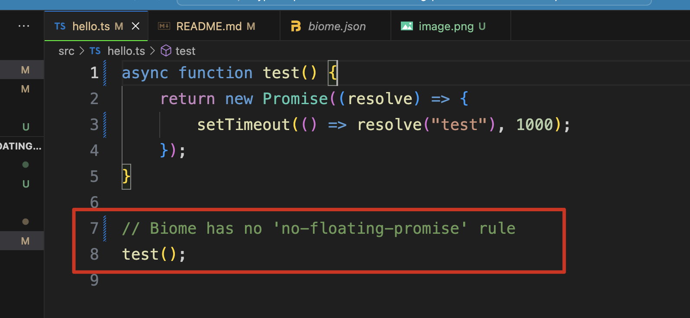

TypeScript React Biome "no-floating-promise" Lint Demo
=================================

Eslint-typescript里有一个我觉得很有用的rule: [no-floating-promises](https://typescript-eslint.io/rules/no-floating-promises/)

目前Biome还不支持



所以虽然代码中存在问题，但下面的命令不会报错。

```
pnpm run lint
pnpm run fix
```

